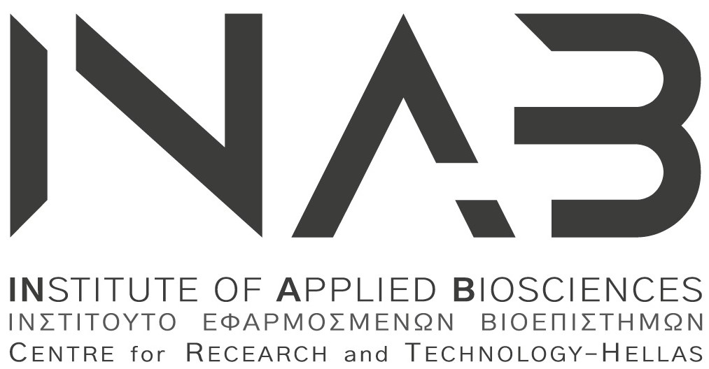
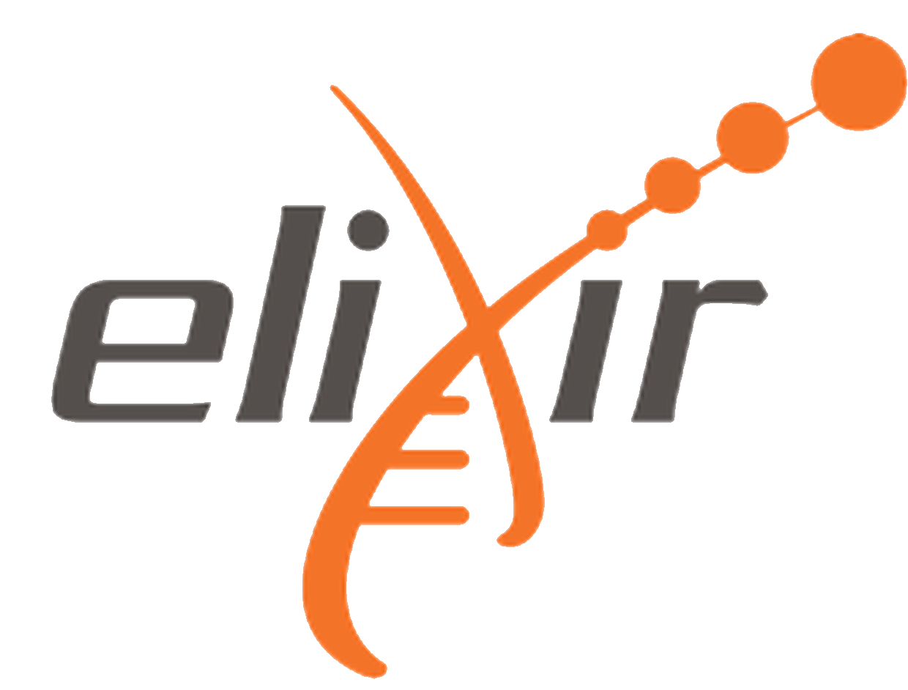

  
  &nbsp;
  
  &nbsp;
  

## Overview

Reproducible research is an important part of good scientific practice. Establishing robust computational analysis workflow facilitates reproducible research. There has been a strong emphasis on establishing graphic workflow management systems, such as Galaxy and Knime. However, the landscape and complexity of Linux command line tools for workflow management is vast and complicated. We aim to take advantage of European/International leaders in the field to present current scientific workflow paradigms and a lead workshops to implement a basic workflow. Topics covered include workflows and containerization.

## Learning objectives

### Docker
- Understand what containerisation is, and why you might use it in bioinformatics
- Be familiar with Docker; basic concepts and structure
- Find and run containers built by other people
- Build your own application into a container (containerisation)
- Distribute your container online

### CWL
- Understand syntax and structure for CWL
- Understand how to write CWL tool definitions for command line tools
- Read and write CWL files written in YAML
- How to run CWL workflows locally and on EG-CI
- Join CWL tools into a workflow
- Use Docker with CWL to provide software dependencies and ensure reproducibility

## Audience and requirements

This introductory tutorial is aimed towards bioinformaticians (graduate students and researchers), who are interested in becoming familiar to Docker based workflows in CWL, as is currently supported by the ΕLIXIR-Greece Compute Infrastructure (EG-CI).

## Prerequisites

- Experience in Shell; this includes basic commands (such as `ls`, `cp`, `mv`, `nano/vim`) and operations such as (`apt`, installing tools etc).

_Maximum participants_: 25

## Registration

**Dates of the workshop**: 25/10/2020

~~Please **register** to the workshop using this [**form**](https://forms.gle/br9JQ1iqbkYmgFQD6).~~

_Deadline_: ~~Mon 16/03/2020~~ (tba)

_Notifications_: ~~Wed 18/03/2020~~ (tba)

## Schedule

| Time  |  Details |
|--------|----------|
| 10:00 - 10:30	| **Tutorial introduction**.     - Get to know each other.   - Setup   [_Link to material_](episodes/setup.md) |
| Part I: Containers Background | |
| 10:30 - 11:30	| **Introduction to Containerization**.    - Concepts and Theory   [_Link to material_](episodes/01-intro.md)
| 11:45 - 13:00	| **Run a container**.   - Examples of how to run an existing Docker container   [_Link to material_](episodes/02-run-container.md) |
| Part II: Building a Container | |
| 14:00 - 15:30 | **Building a container image**.   - How to build a container   [_Link to material_](episodes/03-build-container.md) |
| 15:45 - 17:00	| **Distribute online**    - What are the available options (DockerHub, GitHub)   [_Link to material_](episodes/04-distribution-options.md) |
| Part III: Basics of Workflow Languages | |
| 09:30 - 10:45	| **Intro to workflows**.    - Syntax and structure of CWL   [_Link to material_](episodes/05-cwl-intro.md)
| 11:00 - 12:30	| **Writing a CWL in YAML**.   - Examples of tool definitions in CWL   [_Link to material_](episodes/06-cwl-basic.md) |
| Part IV: Hands-on | |
| 13:30 - 14:45 | **Combining tools in a workflow**.   - Building a complete workflow in CWL   [_Link to material_](episodes/07-cwl-workflow.md) |
| 15:00 - 16:30	| **Deploying a tool on EG-CI**    - Using the ELIXIR-GR e-infrastructure?   [_Link to material_](episodes/08-cwl-infrastructure.md) |
| 16:30 - 17:00	| Closing, discussion and Q&A |

## Venue

National Infrastructures for Research and Technology (GRNET)

Kifisias Avenue 7

115 23, Athens, GR

25 October, 2021

_For more information, check the GRNET contact page [here](https://grnet.gr/en/contact-us/)_.

## Other examples

_< tba >_

## Sources / References

The material in the workshop has been based on the following resources:

_< tba >_

Relevant literature includes:

_< tba >_

## License

This material is made available under the [Creative Commons Attribution 4.0 International license](https://creativecommons.org/licenses/by/4.0). Please see [LICENSE](LICENSE.md) for more details.

## Acknowledgements

This work has been produced with the support of the RDA Europe Ambassador programme. It  has received funding from the European Union’s Horizon 2020 (H2020) research and innovation programme via the RDA EU 4.0 project  (ref. GA no. 777388).

## Citation

_<to be added>_
