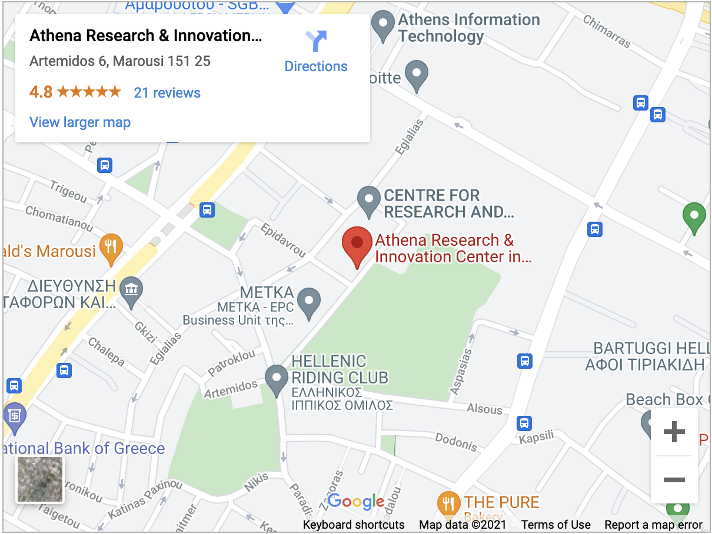

  
  &nbsp;
  
  &nbsp;
  

 

## Overview

Reproducible research is an important part of good scientific practice. Establishing robust computational analysis workflow facilitates reproducible research. There has been a strong emphasis on establishing graphic workflow management systems, such as Galaxy and Knime. However, the landscape and complexity of Linux command line tools for workflow management is vast and complicated. We aim to take advantage of European/International leaders in the field to present current scientific workflow paradigms and a lead workshops to implement a basic workflow. Topics covered include workflows and containerization.

## Learning objectives

### Docker
- Understand what containerisation is, and why you might use it in bioinformatics.
- Be familiar with Docker; basic concepts and structure.
- Find and run containers built by other people.
- Build your own application into a container (containerisation).
- Distribute your container online.

### CWL
- Understand syntax and structure for CWL.
- Understand how to write CWL tool definitions for command line tools.
- Read and write CWL files written in YAML.
- How to run CWL workflows locally and on HYPATIA (formerly EG-CI).
- Join CWL tools into a workflow.
- Use Docker with CWL to provide software dependencies and ensure reproducibility.

## Audience and requirements

This introductory tutorial is aimed towards bioinformaticians (graduate students and researchers), who are interested in becoming familiar to Docker based workflows in CWL, as is currently supported by the ΕLIXIR-Greece Compute Infrastructure (HYPATIA).

## Prerequisites

- Experience in Shell; this includes basic commands (such as `ls`, `cp`, `mv`, `nano/vim`) and operations such as (`apt`, installing tools etc).

_Maximum number of participants_: **15** (will also have live streaming)

### SARS-CoV-2 guidelines

Please note that the venue requires that visitors follow the [EU Digital COVID Certificate scheme](https://ec.europa.eu/info/live-work-travel-eu/coronavirus-response/safe-covid-19-vaccines-europeans/eu-digital-covid-certificate_en) as of the event date. Additional logistical details to help you plan your trip can be found on the event website. Please do not hesitate to get in touch with us if you need further assistance.

## Registration

_Date of the workshop_: ***Monday, October 25th 2021***

Please **register** to the workshop using this [**form**](https://forms.gle/br9JQ1iqbkYmgFQD6).

_Deadline_: Wed 20/10/2021 12:00 local time

_Notifications_: Fri 22/10/2021

_language of conduct_: Greek

## Schedule

| Time  |  Details |
|--------|----------|
| 10:00 - 10:30	| **Tutorial introduction**.   _Link to material_ |
| Part I: Containers Background | |
| 10:30 - 11:30	| **Introduction to Containerization, run a container**.   _Link to material_ |
| Part II: Building a Container | |
| 11:45 - 13:15 | **Building a container, distribute online**.  _Link to material_ |
| Part III: Basics of Workflow Languages - CWL| |
| 14:00 - 15:30	| **Basics of workflow languages, writing CWL**   _Link to material_ |
| 15:30 - 16:45	| **Combining tools in a workflow**.   _Link to material_ |
| Part IV: Introduction to HYPATIA | |
| 17:00 - 18:15	| **Using HYPATIA**.  _Link to material_ |
| 18:15 - 18:45 | **Closing, discussion and Q&A**.  _Link to material_ |

## Venue

"ATHENA" Research Center (ATHENA RC)

Artemidos 6 & Epidavrou

15125, Marousi, GR

_For more information, check the ATHENA RC contact page [here](https://www.athenarc.gr/en/contact-0)_.

## License

This material is made available under the [Creative Commons Attribution 4.0 International license](https://creativecommons.org/licenses/by/4.0). Please see [LICENSE](LICENSE.md) for more details.

## Acknowledgements

We acknowledge support of this work by the project “ELIXIR-GR: Managing and Analysing Life Sciences Data” (MIS: 5002780) which is implemented under the Action “Reinforcement of the Research and Innovation Infrastructure”, funded by the Operational Programme "Competitiveness, Entrepreneurship and Innovation" (NSRF 2014-2020) and co-financed by Greece and the European Union (European Regional Development Fund). 

   
  

